ROOMQUEST ANDROID MOBILE APPLICATION

RoomQuest is an android mobil application, written in Java, that allows users (students, visitors, faculty and staff of Cal State San Bernardino) find their way around the University. It uses the ArcGIS geographic information system, ArcGIS Runtime SDK for Android and ArcGIS Enterprise Server. It finds rooms, professors, and other student resources.

TO VIEW SOURCE CODE: 
go up one directory from here and then
go to /app/src/main/java/roomquest/cse/csusb/edu/roomquest on this git repository.

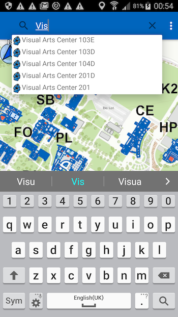

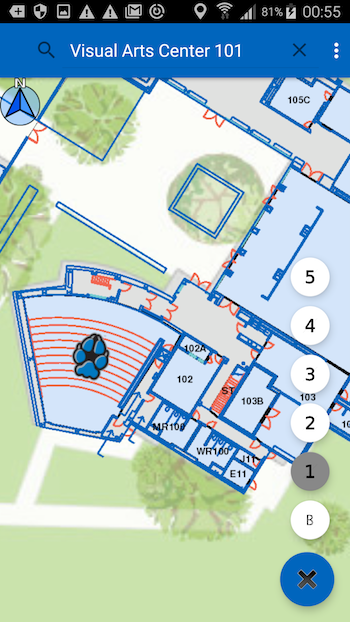
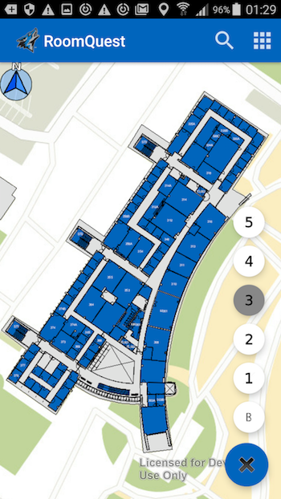

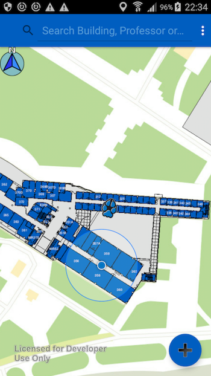
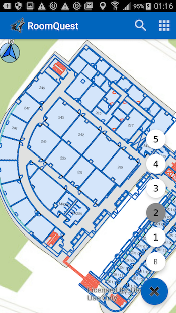

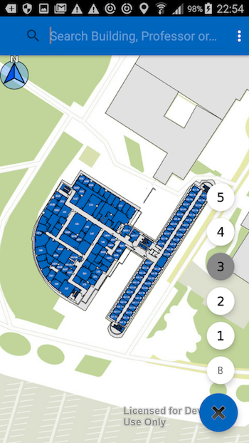
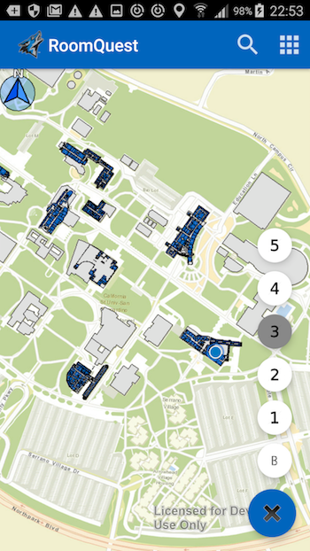

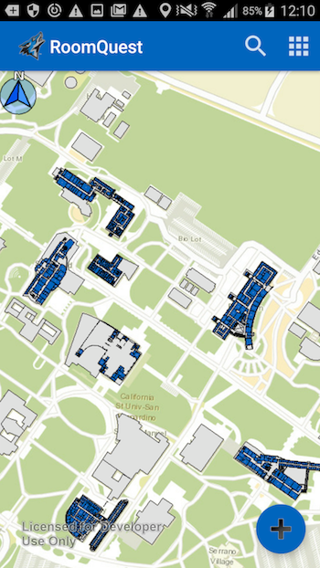
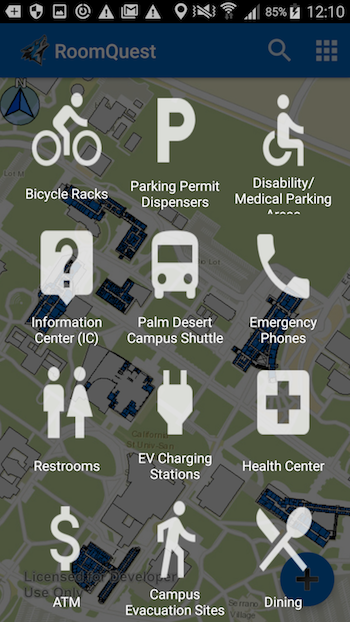

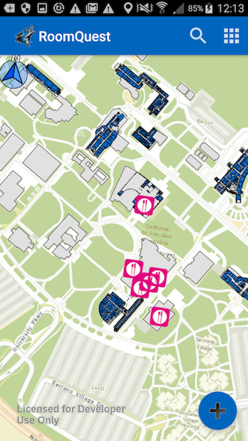

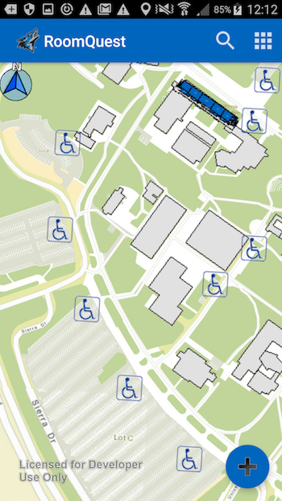
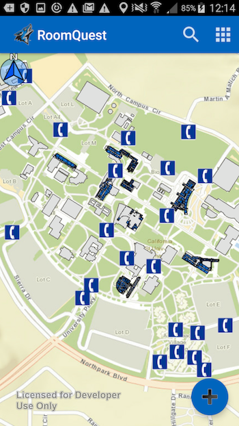

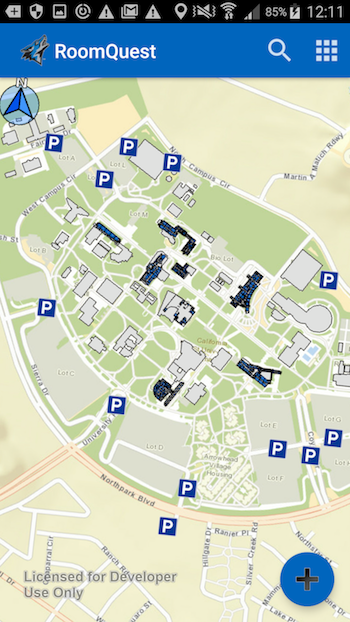

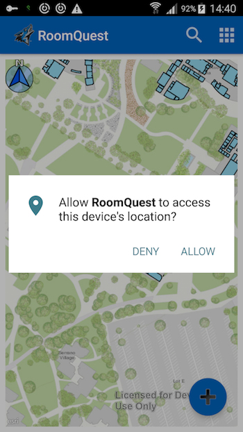
